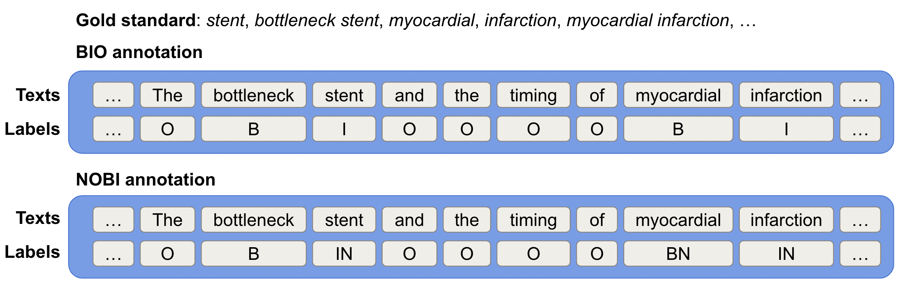

# NOBI annotation regime - ACTER v.1.6; RSDO5 v.1.2

ACTER is a collection of manually annotated corpora for term extraction whose terms and/or named entities were labelled from the following domains: corruption, wind energy, equitation, and heart failure and are available in English, French, and Dutch. 

- The original corpora (v.1.1-v1.5) are available at [AylaRT/ACTER](https://github.com/AylaRT/ACTER).

Meanwhile, RSDO5 is a manually annotated corpus for Slovenian language in the domain of biomechanics, linguistics, chemistry, or veterinary science.

- The original version of RSDO (v1.0, v1.1) corpus is available at [Corpus of term-annotated texts RSDO5](https://www.clarin.si/repository/xmlui/handle/11356/1470).

In this repo, we provide the annotated corpora in NOBI annotation format with additional information about term position and extracted term list per sentence for both datasets.

---

## 1. General information

- Creator: [@honghanhh](https://github.com/honghanhh)
- Association: Jozef Stefan Institute, Slovenia and La Rochelle University, France
- Version: ACTER v1.6, RSDO5 v1.2
- Date of creation version 1.6: 10/10/2022
- Date of last update: 27/01/2023
- Contact: [@honghanhh](hanh.usth@gmail.com)
- Source: [https://github.com/honghanhh/NOBI_ACTER](https://github.com/honghanhh/NOBI_ACTER)
- License: [CC BY-NC-SA 4.0](https://creativecommons.org/licenses/by-nc-sa/4.0/)

## 2. Abbreviations

| Abbreviation | Meaning |
|--------------|---------|
| ACTER        | Annotated Corpora for Term Extraction Research |
| RSDO         | Corpus of term-annotated texts RSDO5 1.0 |
| BIO          | Begin, Inside, Outside annotation|
| NOBI         | Nested BIO annotation|
| en           | English |
| fr           | French |
| nl           | Dutch |
| corp         | Corruption |
| equi         | Equitation (dressage) |
| htfl         | Heart failure |
| wind         | Wind energy |

## 3. Data Structure

```
.
├── ACTER
│   ├── en
│   │   ├── with_named_entities
│   │   │   ├── en_corp_nes.csv
│   │   │   ├── en_equi_nes.csv
│   │   │   ├── en_htfl_nes.csv
│   │   │   └── en_wind_nes.csv
│   │   └── without_named_entities
│   │       ├── en_corp_ann.csv
│   │       ├── en_equi_ann.csv
│   │       ├── en_htfl_ann.csv
│   │       └── en_wind_ann.csv
│   ├── fr
│   │   ├── with_named_entities
│   │   │   ├── fr_corp_nes.csv
│   │   │   ├── fr_equi_nes.csv
│   │   │   ├── fr_htfl_nes.csv
│   │   │   └── fr_wind_nes.csv
│   │   └── without_named_entities
│   │       ├── fr_corp_ann.csv
│   │       ├── fr_equi_ann.csv
│   │       ├── fr_htfl_ann.csv
│   │       └── fr_wind_ann.csv
│   └── nl
│       ├── with_named_entities
│       │   ├── nl_corp_nes.csv
│       │   ├── nl_equi_nes.csv
│       │   ├── nl_htfl_nes.csv
│       │   └── nl_wind_nes.csv
│       └── without_named_entities
│           ├── nl_corp_ann.csv
│           ├── nl_equi_ann.csv
│           ├── nl_htfl_ann.csv
│           └── nl_wind_ann.csv
└── RSDO5
    └── sl
        ├── bim.csv
        ├── kem.csv
        ├── ling.csv
        └── vet.csv

13 directories, 28 files
```

## 4. Annotations

### 4.1. General

The annotations are provided in simple UTF-8 encoded plain text files. No lemmatisation was performed.

### 4.2. Annotation scheme

Each annotated file (e.g., `en_corp_nes.csv`) contains the following columns: `words`, `labels`, `entities`, `term_list`. The `words` column contains the original text, the `labels` column contains the NOBI annotation, the `entities` column contains the position of the terms in the sentence, the `term_list` column contains the terms extracted from the text. For example, the first 5 row of the `en_corp_nes.csv` file is as follows:

|words|labels|entities|term_list|
|-----|------|--------|---------|
|['Protecting', 'the', 'EU', ""'s"", 'financial', 'interests', '-', 'fight', 'against', 'fraud']|['O', 'O', 'B-Term', 'O', 'BN-Term', 'I-Term', 'O', 'B-Term', 'I-Term', 'IN-Term']|{('Term', 2, 2), ('Term', 4, 5), ('Term', 7, 9)}|['EU', 'financial interests', 'fight against fraud']|
|['Since', '1995', ',', 'a', 'convention', 'has', 'been', 'in', 'place', 'which', 'seeks', 'to', 'protect', ',', 'under', 'criminal', 'law', ',', 'the', 'financial', 'interests', 'of', 'the', 'EU', 'and', 'its', 'taxpayers', '.']|['O', 'O', 'O', 'O', 'O', 'O', 'O', 'O', 'O', 'O', 'O', 'O', 'O', 'O', 'O', 'BN-Term', 'IN-Term', 'O', 'O', 'BN-Term', 'I-Term', 'O', 'O', 'B-Term', 'O', 'O', 'B-Term', 'O']|{('Term', 26, 26), ('Term', 19, 20), ('Term', 15, 16), ('Term', 23, 23)}|['taxpayers', 'financial interests', 'criminal law', 'EU']|
|['Over', 'the', 'years', ',', 'the', 'Convention', 'on', 'the', 'Protection', 'of', 'the', 'European', 'Communities', ""'"", 'Financial', 'Interests', 'has', 'been', 'supplemented', 'by', 'a', 'series', 'of', 'protocols', '.']|['O', 'O', 'O', 'O', 'O', 'B-Term', 'I-Term', 'I-Term', 'I-Term', 'I-Term', 'I-Term', 'I-Term', 'I-Term', 'I-Term', 'I-Term', 'I-Term', 'O', 'O', 'O', 'O', 'O', 'O', 'O', 'O', 'O']|{('Term', 5, 15)}|["Convention on the Protection of the European Communities ' Financial Interests"]|
|['ACT']|['O']|{}|[]|
|['Council', 'Act', 'of', '26', 'July', '1995', 'drawing', 'up', 'the', 'Convention', 'on', 'the', 'protection', 'of', 'the', 'European', 'Communities', ""'"", 'financial', 'interests']|['B-Term', 'O', 'O', 'O', 'O', 'O', 'O', 'O', 'O', 'B-Term', 'I-Term', 'I-Term', 'I-Term', 'I-Term', 'I-Term', 'I-Term', 'I-Term', 'I-Term', 'IN-Term', 'IN-Term']|{('Term', 9, 19), ('Term', 0, 0)}|["Convention on the protection of the European Communities ' financial interests", 'Council']|

The NOBI annotation is an extension of BIO annotation scheme where we have 5 labels, including 3 existing labels in BIO (`B-Term`, `I-Term`, `O`) with 2 additional labels for single nested term (`BN-Term`, `IN-Term`). The `B-Term` and `I-Term` labels are used for the beginning and inside of a term, respectively. The `BN-Term` and `IN-Term` labels are used for the beginning and inside of a single nested term, respectively. The `O` label is used for non-term tokens. For example, the following sentence is annotated as follows:



In these examples, the gold standard contains the following terms: `stent`, `bottleneck stent`, `myocardial`, `infarction`, `myocardial infarction`, etc. In the NOBI regime, we consider `bottleneck stent` and `stent` as two different terms where `stent` is the nested term of `bottleneck stent`, in contrast to the BIO scheme, where the model extracts just the `bottleneck stent` as a term. Similarly, `myocardial` and `infarction` are two separate terms that are nested from `myocardial infarction`. Therefore, an additional label N is added to the label of `stent`, `myocardial`, and `infarction`.

We further provide the position of the terms in the sentence in the `entities` column and the `term_list` column contains the terms extracted from the each sentence in each row for futher usage.

## References

- Rigouts Terryn, A., Hoste, V., & Lefever, E. (2022). Tagging Terms in Text: A Supervised Sequential Labelling Approach to Automatic Term Extraction. Terminology. International Journal of Theoretical and Applied Issues in Specialized Communication, 28(1). [https://doi.org/10.1075/term.21010.rig](https://doi.org/10.1075/term.21010.rig).
- [ACTER Annotated Corpora for Term Extraction Research, version 1.5](https://github.com/AylaRT/ACTER)
- Jemec Tomazin, M., Trojar, M., Atelšek, S., Fajfar, T., Erjavec, T., Žagar Karer, M.: Corpus of term-annotated texts RSDO5 1.1 (2021), [http://hdl.handle.net/11356/1470](http://hdl.handle.net/11356/1470), slovenian language resource repository CLARIN.SI
